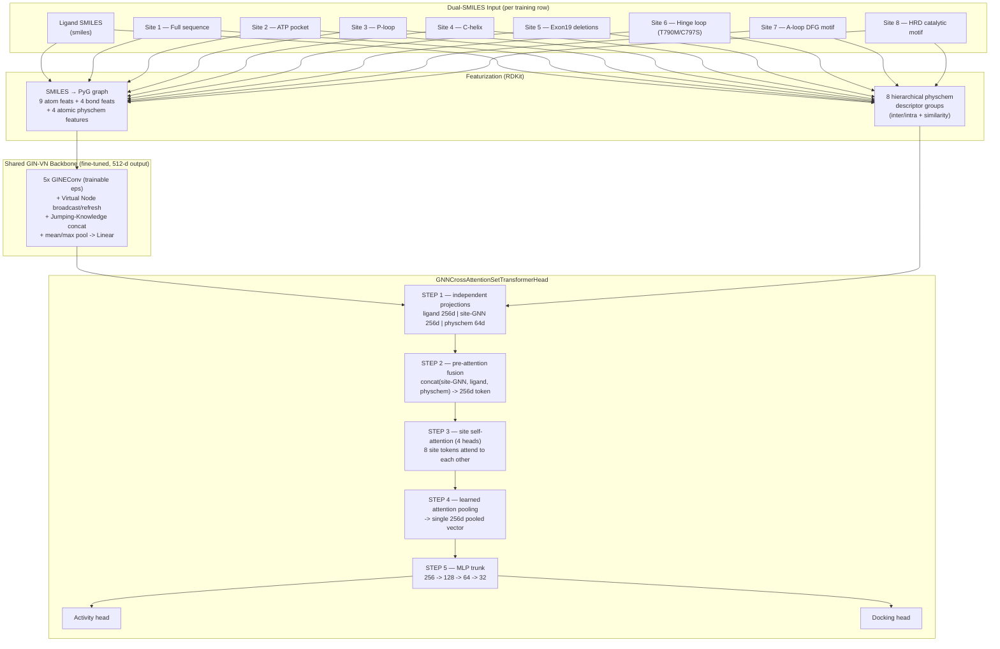

# EGFR-TKI Mutation-Informed GNN — Dual-SMILES Activity & Docking Predictor

**A graph neural network that jointly encodes a drug candidate *and* the specific mutant kinase pocket it must bind, to predict binding activity and docking score for EGFR tyrosine-kinase inhibitors (TKIs) in non-small-cell lung cancer (NSCLC).**

Repository: [AI-ML-drug-discovery-EGFR-TKI-lung-cancer-Mutation-Informed-GNN-Dual-Smiles](https://github.com/rhubainmageswaran/AI-ML-drug-discovery-EGFR-TKI-lung-cancer-Mutation-Informed-GNN-Dual-Smiles)

`Python` · `PyTorch` · `PyTorch Geometric` · `RDKit` · `scikit-learn` · `pandas`

---

## Table of Contents

1. [Overview](#overview)
2. [The Dual-SMILES, Mutation-Informed Concept](#the-dual-smiles-mutation-informed-concept)
3. [Scientific Background](#scientific-background)
4. [Key Features](#key-features)
5. [Architecture](#architecture)
   - [5.1 Molecular Graph Featurization](#51-molecular-graph-featurization)
   - [5.2 GIN + Virtual Node + Jumping-Knowledge Backbone](#52-gin--virtual-node--jumping-knowledge-backbone)
   - [5.3 Hierarchical Physicochemical Descriptor Engine](#53-hierarchical-physicochemical-descriptor-engine)
   - [5.4 Cross-Modal Fusion + Site Self-Attention Head](#54-cross-modal-fusion--site-self-attention-head)
   - [5.5 Multi-Task Prediction Heads](#55-multi-task-prediction-heads)
6. [Engineering Evolution](#engineering-evolution)
7. [Repository Layout](#repository-layout)
8. [Installation](#installation)
9. [Data Schema](#data-schema)
10. [Usage](#usage)
    - [10.1 Training](#101-training)
    - [10.2 Prediction / Inference](#102-prediction--inference)
11. [Outputs & Artifacts](#outputs--artifacts)
12. [Evaluation & Metrics](#evaluation--metrics)
13. [Hyperparameter Reference](#hyperparameter-reference)
14. [Notes for Reuse & Maintainers](#notes-for-reuse--maintainers)
15. [Roadmap](#roadmap)
16. [References](#references)
17. [Model Card: Intended Use & Limitations](#model-card-intended-use--limitations)
18. [License](#license)

---

## Overview

This project predicts two properties for a **(ligand, EGFR-mutant)** pair in a single forward pass:

| Task | Target column | Transform | Meaning |
|---|---|---|---|
| **Activity** | `standard value` | `log1p` → `StandardScaler` | Binding potency (e.g. IC50/Ki-type readout) of the ligand against the specified EGFR mutant |
| **Docking**  | `dock` | `StandardScaler` | Docking/binding-pose score of the ligand against the specified EGFR mutant |

Both targets are produced by one shared graph neural network that is **fine-tuned end-to-end** — the same backbone that embeds the drug molecule also embeds eight structurally-defined regions of the mutant kinase domain, and both embeddings are learned jointly with the downstream regression heads rather than trained as two separate stages.

The project ships as a **matched training/inference pair**:

| Script | Role |
|---|---|
| `adv_physchem_gnn_base1d_variant.py` | End-to-end training: data loading, featurization, GNN backbone, downstream head, training loop, checkpointing |
| `predict_adv_physchem_gnn_base1d_variant.py` | Inference: re-implements the identical featurization/model code, loads the training checkpoint, scores new compounds, and (if labels are present) reports evaluation metrics and diagnostic plots |

> These scripts implement the **activity/docking prediction** component referenced by the broader interactive drug-discovery interface for this project (a FastAPI backend that also exposes molecular docking, ligand generation, and osimertinib-analog-design endpoints). This repository focuses specifically on the modeling layer: featurization, the GNN architecture, and the training/inference scripts.

---

## The Dual-SMILES, Mutation-Informed Concept

Most ligand-affinity models encode **one** molecule (the drug) and treat the protein target as either a fixed label, a hand-crafted descriptor set, or a separately-trained sequence/structure embedding. This project takes a different approach: it represents **both sides of the binding event as SMILES strings** and pushes both through the **same graph neural network**.

- **Ligand SMILES** — the small-molecule TKI candidate (`smiles` column).
- **Mutant-site SMILES** — instead of one SMILES for "the protein," the EGFR tyrosine-kinase domain is decomposed into **eight mechanistically ordered structural regions**, each represented as its own SMILES string (substructure/pocket-motif representation), reflecting the exact path an inhibitor mechanistically encounters/depends on:

  ```
  FULL SEQUENCE → ATP POCKET → P-LOOP → C-HELIX → EXON19 DELETIONS →
  HINGE LOOP (T790M / C797S) → A-LOOP DFG MOTIF → HRD CATALYTIC MOTIF
  ```

Because *both* the drug and every mutant region are expressed in the same chemical-graph language, a **single shared GIN encoder** produces embeddings for all nine graphs (1 ligand + 8 sites) in one common latent space. This is what makes the downstream **cross-modal fusion and site self-attention** possible: the ligand token and each of the eight site tokens are directly comparable vectors that a fusion/attention block can combine, rather than two incompatible representations (e.g., a molecular graph and a protein language-model embedding) that would need a separate alignment step.

The **"mutation-informed"** part of the name follows directly from this: every one of the eight sites carries the actual mutation status baked into its SMILES (e.g., the hinge-loop site encodes the T790M/C797S resistance mutations), so the model is conditioned on the *specific resistance profile* of the target, not just a generic "EGFR" label.

---

## Scientific Background

EGFR-mutant NSCLC is treated with successive generations of tyrosine-kinase inhibitors, but tumors reliably acquire resistance through secondary mutations in the kinase domain — most notably the **T790M gatekeeper mutation** and, against later-generation covalent inhibitors, the **C797S** mutation at the covalent-binding cysteine, frequently on a background of **exon-19 deletions** or **L858R**. Because these resistance mutations sit in specific structural regions of the kinase domain (the ATP-binding pocket, the P-loop, the C-helix, the activation loop's DFG motif, the catalytic HRD motif, and the hinge region), a model that is explicitly aware of *which region* changed — rather than a single opaque "mutant" label — has a better chance of generalizing to resistance profiles not seen during training. That per-region decomposition is exactly what the eight mutation-site SMILES columns encode.

---

## Key Features

- **Dual-SMILES multimodal input** — one ligand graph + eight mutation-site graphs per training row, processed by a single shared, fine-tuned GNN backbone.
- **OGB-style rich graph featurization** — 9 categorical atom features and 4 categorical bond features (à la Hu et al.'s Open Graph Benchmark), plus **continuous atom-level physicochemical context** (Gasteiger partial charge, Crippen logP/MR atomic contributions, TPSA atomic contribution) fused directly into every node embedding.
- **GIN + Virtual Node + Jumping-Knowledge backbone** — trainable-epsilon GINEConv message passing, a per-graph virtual node for cheap global context, and Jumping-Knowledge concatenation across all layer depths before mean+max pooling.
- **True end-to-end fine-tuning** — the GNN backbone and the downstream head share one PyTorch autograd graph and one optimizer; there is no frozen/precomputed-embedding stage.
- **Hierarchical hand-crafted physicochemistry** — eight groups of RDKit-derived descriptors (H-bonding, electrostatics, polar surface area, rigidity, aromaticity/π-stacking, fingerprint similarity, and ligand↔mutant interaction terms) computed independently of the GNN and fused in as a complementary, never-suppressing signal via a gated projection.
- **Permutation-invariant site modeling** — the eight mutation sites are treated as a genuine **unordered set**: a Set-Transformer-style self-attention block lets sites influence each other directly (e.g., recognizing that a P-loop change *and* a DFG-motif change jointly confer resistance), followed by learned attention pooling into one fixed-size summary.
- **Multi-task regression** — one shared trunk feeds two lightweight heads that jointly predict **activity** and **docking score**, trained with a weighted composite MSE loss.
- **Reproducible, leak-free pipeline** — a seeded random 80/20 train/validation split computed *before* any scaler is fit, with every scaler (physchem, and both target scalers) fit strictly on training rows only.
- **Train/predict parity by construction** — the prediction script re-implements every featurization function and model class identically to the training script and loads the exact checkpoint it produced, so there is no risk of silent train/serve skew.
- **Graceful degradation** — if `torch_geometric` isn't installed, both scripts fall back to a Morgan-fingerprint + MLP embedding path instead of crashing.
- **Built-in evaluation suite** — MAE, RMSE, Pearson R, and Spearman ρ, computed both overall and per individual mutant, with auto-generated scatter/correlation plots.

---

## Architecture



### 5.1 Molecular Graph Featurization

Every SMILES string (ligand and each of the 8 sites) is parsed by RDKit and converted to a `torch_geometric.data.Data` object:

| Level | Feature | Type | Cardinality |
|---|---|---|---|
| Atom | atomic number, chirality, degree, formal charge, #H, #radical electrons, hybridization, aromaticity, ring membership | 9 categorical (embedding lookup, summed) | 119 / 4 / 12 / 12 / 10 / 6 / 6 / 2 / 2 |
| Atom | Gasteiger partial charge, Crippen logP contribution, Crippen MR contribution, TPSA contribution | 4 continuous, projected and added to the categorical sum | — |
| Bond | bond type, stereo, conjugation, ring membership | 4 categorical (embedding lookup, summed) | 5 / 7 / 2 / 2 |

Unseen categorical values fall back to a trailing **"misc"** bucket (`safe_index`) instead of raising, matching the OGB feature-vocabulary convention. Any SMILES RDKit cannot parse is excluded from training/inference and logged rather than crashing the run.

Parsed graph **structure** is cached to disk (`smiles_graph_structure_cache.pkl`) — this cache depends only on the SMILES string, never on model weights, so it is valid indefinitely and is reused directly by the prediction script.

### 5.2 GIN + Virtual Node + Jumping-Knowledge Backbone

`GINVirtualNet` (5 layers, 300-d hidden embedding, 512-d output) is the shared encoder for the ligand and all 8 mutation sites:

- **GINEConv with trainable epsilon** (Xu et al., "How Powerful Are Graph Neural Networks?") — edge features flow through a `BondEncoderRich` and are added into the message before a 2-layer MLP update.
- **Virtual Node** — a learned per-graph token, broadcast onto every atom and refreshed by sum-pooling atom states after each layer, giving every node cheap access to whole-molecule context without extra message-passing hops.
- **Jumping-Knowledge concatenation** (Xu et al., 2018) — atom representations from *every* layer (not just the last) are concatenated before pooling, so both short-range and long-range substructure signal reach the final embedding.
- **Mean + max graph pooling**, concatenated for a more discriminative graph-level readout than mean pooling alone.
- Optional **warm-start** from a pretrained checkpoint (`checkpoints/gin_vn_pretrained.pth`): weights are copied only where both parameter name *and* shape match, so the model degrades gracefully to random initialization for any layer that doesn't match rather than crashing — this backbone is fine-tuned from that point onward regardless.

### 5.3 Hierarchical Physicochemical Descriptor Engine

Independently of the GNN, each ligand↔mutation-site pair is scored with eight groups of interpretable RDKit descriptors:

| Group | Captures |
|---|---|
| `lig_inter` / `mut_inter` | H-bond donors/acceptors, partial-charge extremes, TPSA, Labute ASA, molar refractivity, molecular weight, rotatable bonds, LogP, aromatic-ring counts, halogen count |
| `lig_intra` / `mut_intra` | Bond-order composition, rigid-bond fraction, hybridization counts, ring-size statistics, spiro/bridgehead atoms, Bertz/Kappa complexity indices |
| `inter_interaction` / `intra_interaction` | Cosine similarity and dissimilarity between the ligand's and the mutant-site's inter-/intra-molecular descriptor vectors |
| `lig_mut_mix_inter_intra` | Hand-derived combination terms (e.g. H-bond-donor/acceptor ratios weighted by mutant intramolecular path complexity) modeling how ligand H-bonding competes against the mutant site's own intramolecular bonding |
| `final_fp_interaction` | Dice and Tanimoto similarity between Morgan fingerprints of the ligand and the mutant site |

These eight groups are concatenated into one physchem vector per site (`combine_physchem_features`) and scaled with a single `StandardScaler` pooled across all 8 sites (consistent with the shared-weight physchem projection inside the head), **fit on training rows only**.

### 5.4 Cross-Modal Fusion + Site Self-Attention Head

`GNNCrossAttentionSetTransformerHead` deliberately keeps the pipeline to one coherent pathway:

1. **Independent encoders** — ligand GNN embedding, site GNN embeddings, and site physchem vectors are each projected independently (no premature mixing).
2. **One explicit fusion** — every site token is built from `concat(site-GNN, ligand, physchem)` and projected down to a 256-d fused token. The ligand's global context is broadcast (tiled) across all 8 sites here.
3. **One site self-attention block** — a custom multi-head attention layer (a faithful PyTorch port of `tf.keras.layers.MultiHeadAttention`, supporting differing query/key-value widths) lets the 8 *already ligand-aware* site tokens attend to **each other**, followed by a feed-forward block with residual connections and LayerNorm.
4. **Learned attention pooling** — a small scoring MLP produces one attention weight per site; a softmax-weighted sum collapses the 8 (permutation-invariant) site tokens into a single 256-d vector.
5. **Multitask MLP trunk** — 256 → 128 → 64 → 32, feeding two independent small heads.

This design intentionally omits an earlier, more elaborate variant of the head (bidirectional ligand↔site cross-attention, a parallel raw-GNN branch, and a separate SAB+PMA stack) in favor of one clear fusion → attention → pooling → prediction pathway — see [Engineering Evolution](#engineering-evolution).

### 5.5 Multi-Task Prediction Heads

Two small heads (`32 → 16 → 1`) branch off the shared trunk:

- **Activity head** — predicts standardized `log1p(standard value)`.
- **Docking head** — predicts standardized `dock`.

Both are optimized jointly with a weighted MSE loss: `loss = 1.0 * MSE(activity) + 0.7 * MSE(docking)`.

---

## Engineering Evolution

The training script's inline documentation records a clear lineage of design decisions, summarized here:

| Stage | Change |
|---|---|
| **base1b → base1c** | Upgraded from the original 2-feature MolCLR atom/bond encoding to the richer 9-feature atom / 4-feature bond OGB-style encoding, plus atomic physchem context, trainable-epsilon GINEConv, Virtual Node, Jumping-Knowledge, and mean+max pooling. |
| **base1c → base1d (fusion head)** | Replaced a BiLSTM+BiGRU "RNN over 8 sites" fusion stage with a Set-Transformer-style self-attention block, correctly modeling the 8 mutation sites as an **unordered set** rather than an implicitly-ordered sequence. Also replaced an index-sliced 80/20 `validation_split` with an explicit, reproducible **random** split. |
| **Frozen → fine-tuned** | The original pipeline computed GNN embeddings once under `torch.no_grad()` and fed the detached NumPy result into a *separately trained Keras model* — gradients from the activity/docking loss could never reach the GNN's weights. This was replaced with a single PyTorch `nn.Module` graph (GNN backbone + head) trained jointly by one optimizer, so the GNN is genuinely fine-tuned end-to-end. |
| **base1d_1024d → base1d_simple (this head)** | Removed a parallel 1024-d raw-GNN branch, a 1600-d raw-skip concatenation, bidirectional ligand↔site cross-attention, and a separate SAB+PMA stack, in favor of the single fusion → self-attention → pooling pathway described above — fewer parameters, and an architecture that is easier to reason about. |
| **6 sites → 8-site mechanistic order** | Mutation-site columns were reorganized from an ad hoc 6-column layout (which merged the P-loop and hinge loop into one column) into the current 8-site mechanistic order matching how an inhibitor actually encounters the kinase domain. |

A companion script (referenced in the training script's TODOs but not included in this pair) explores replacing the mutation-site SMILES featurization with protein-language-model (e.g. ESM-2) embeddings on the actual mutant amino-acid sequence — see [Roadmap](#roadmap).

---

## Repository Layout

The two scripts documented here are self-contained; the layout below reflects the files they read and write. Adjust to match the actual repository tree.

```
.
├── adv_physchem_gnn_base1d_variant.py        # training entry point
├── predict_adv_physchem_gnn_base1d_variant.py  # inference entry point
├── checkpoints/
│   └── gin_vn_pretrained.pth                 # optional warm-start weights (name/shape-matched only)
├── <training_data>.csv                       # your training CSV (see Data Schema)
│
├── gnn_cross_attention_settransformer_simple_finetuned.pt   # [output] fine-tuned checkpoint
├── feature_scalers.pkl                       # [output] physchem StandardScaler
├── y_scalers.pkl                              # [output] activity + docking StandardScalers
├── mutation_profiles.csv                      # [output] unique 8-site SMILES profile per `tkd`
├── random_split_indices.npz                   # [output] train/val row indices (audit trail)
├── smiles_graph_structure_cache.pkl            # [output/reused] SMILES -> parsed graph cache
├── gnn_simple_settransformer_training_history.png  # [output] loss/MAE curves
│
└── prediction_output/                         # [output of predict script] --output_dir
    ├── predictions_gnn_cross_attention_settransformer_simple.csv
    ├── metrics/
    │   └── gnn_cross_attention_settransformer_simple_metrics_summary.csv
    └── plots/
        └── ... (scatter / correlation plots)
```

---

## Installation

```bash
# Core scientific stack
pip install numpy pandas scikit-learn scipy matplotlib loguru

# Cheminformatics
pip install rdkit

# PyTorch (choose the build matching your CUDA/CPU setup)
pip install torch

# PyTorch Geometric (required for the GNN path; scripts fall back to an
# MLP-on-fingerprints mode if this is unavailable, but the dual-SMILES
# graph model described in this README requires it)
pip install torch_geometric
```

Both scripts pin `numpy`/`torch` random seeds to `42` and force `CUDA_VISIBLE_DEVICES=''` off unless a CUDA device is explicitly detected at runtime (`torch.device('cuda' if torch.cuda.is_available() else 'cpu')`), so results are reproducible across runs given the same environment and data.

---

## Data Schema

The training CSV must contain the following columns (exact names, including the stray leading space RDKit/pandas will preserve in one column name):

| Column | Role |
|---|---|
| `smiles` | Ligand SMILES |
| `smiles_full_sequence_egfr_manual` | Site 1 — Full sequence |
| `smiles_sequence_atp_ pocket` | Site 2 — ATP pocket *(note the literal space before "pocket" — this must match exactly)* |
| `smiles_sequence_p_loop_constant` | Site 3 — P-loop |
| `smiles_sequence_c_helix_constant` | Site 4 — C-helix |
| `smiles_sequence_19_deletions` | Site 5 — Exon19 deletions |
| `smiles_sequence_hinge_loop_t790m_c797s` | Site 6 — Hinge loop (T790M/C797S) |
| `smiles_sequence_a_loop_dfg` | Site 7 — Activation-loop DFG motif |
| `smiles_sequence_hrd_constant` | Site 8 — HRD catalytic motif |
| `tkd` | Mutant/tyrosine-kinase-domain profile identifier — groups rows sharing the same 8-site SMILES profile |
| `standard value` | Activity label (e.g. IC50/Ki-type potency) — training target 1 |
| `dock` | Docking-score label — training target 2 |

Rows with any missing value in the required columns are dropped before featurization; the console output reports the missing-value rate per column and the final valid-sample count.

The **prediction** CSV requires only `smiles` and `tkd`. The 8 mutation-site SMILES columns are optional there: if omitted, the script looks up each `tkd`'s 8-site profile from `mutation_profiles.csv` (saved automatically by the training script). Optional `standard value` / `dock` columns, if both present, trigger automatic evaluation-metric computation.

---

## Usage

### 10.1 Training

```bash
python adv_physchem_gnn_base1d_variant.py
```

The training CSV path is currently set directly in the script's "Load Data" section (near the top of `main()`'s preceding module-level code) — update it to point at your dataset, or use the commented-out alternative that reads a file named `trainset_valid_n_nonvalid_tki.csv` from the script's own directory.

What happens, in order:

1. **Stage 0** — initialize the `GINVirtualNet` backbone; warm-start from `checkpoints/gin_vn_pretrained.pth` if present (shape-matched tensors only).
2. **Stage 1** — generate the 8 hierarchical physchem descriptor groups for every mutation site, build/extend the SMILES→graph structure cache, and intersect validity across all 8 sites plus graph-parseability to get `common_valid_indices`.
3. **Random split** — a seeded 80/20 train/validation split over `common_valid_indices`; all scalers (physchem, activity target, docking target) are fit on the training rows only.
4. **Stage 2** — joint fine-tuning: one Adam optimizer (`lr=0.001`) over both the GNN backbone's and the head's parameters, weighted composite MSE loss, manual early stopping (`patience=40`) with best-checkpoint restore, up to `epochs=150` at `batch_size=32`.
5. Saves the checkpoint, scalers, mutation profiles, split indices, graph cache, and a loss/MAE training-history plot.

### 10.2 Prediction / Inference

```bash
python predict_adv_physchem_gnn_base1d_variant.py \
    --input validated_testset.csv \
    --model_dir . \
    --output_dir ./prediction_output
```

| Argument | Default | Description |
|---|---|---|
| `--input` | *(required)* | Path to the input CSV (`smiles`, `tkd`, optionally the 8 site columns and/or `standard value`/`dock`) |
| `--model_dir` | `.` | Directory containing the training checkpoint and saved scalers/profiles |
| `--output_dir` | `.` | Directory to write predictions, metrics, and plots to |

The script groups the input by `tkd`, resolves each mutant's 8-site SMILES profile, regenerates the identical physchem features and graph embeddings used in training (transform-only — no scaler is refit), and runs both prediction heads in `torch.no_grad()` batches (`predict_batch_size = 64`). Predictions are inverse-transformed back to the original scale (`expm1` + inverse `StandardScaler` for activity; inverse `StandardScaler` for docking) before being written out.

---

## Outputs & Artifacts

**From training:**

| File | Contents |
|---|---|
| `gnn_cross_attention_settransformer_simple_finetuned.pt` | `gnn_state_dict`, `head_state_dict`, best epoch, best validation loss, and the head's hyperparameters — the single checkpoint the predict script loads |
| `feature_scalers.pkl` | `{'physchem_scaler': ...}` |
| `y_scalers.pkl` | `{'y_scaler1': <activity scaler>, 'y_scaler2': <docking scaler>}` |
| `mutation_profiles.csv` | One row per unique `tkd`, with its 8-site SMILES — enables prediction on new compounds against known mutants without re-supplying site SMILES |
| `random_split_indices.npz` | The exact `train_idx` / `val_idx` arrays, for auditability |
| `smiles_graph_structure_cache.pkl` | Every parsed SMILES→graph structure seen so far (weight-independent, reused across runs) |
| `gnn_simple_settransformer_training_history.png` | Train/validation loss and activity-MAE curves |

**From prediction:**

| File | Contents |
|---|---|
| `predictions_gnn_cross_attention_settransformer_simple.csv` | `smiles`, `tkd`, `predicted_activity`, `predicted_docking` (+ `actual_*` columns and any passthrough input columns) |
| `metrics/*_metrics_summary.csv` | Overall + per-mutation MAE, RMSE, Pearson R (with p-value), Spearman ρ (with p-value) — only produced when ground-truth columns are present |
| `plots/` | Scatter plots of predicted vs. actual activity/docking, overall and per mutation |

---

## Evaluation & Metrics

When the input CSV includes both `standard value` and `dock`, `evaluate_and_plot()` reports, for the overall dataset and separately for **every individual mutant** (`tkd` group with ≥ 2 samples):

- **MAE** and **RMSE** for both activity and docking
- **Pearson R** (linear correlation) with p-value
- **Spearman ρ** (rank correlation) with p-value
- A combined 2×2 diagnostic figure (predicted-vs-actual scatter with a perfect-prediction reference line) for activity and docking

Per-mutation breakdowns are what let you check whether the model generalizes evenly across resistance profiles (e.g. wild-type vs. T790M/C797S double mutants) rather than being dominated by whichever mutant is best represented in the data.

---

## Hyperparameter Reference

| Component | Parameter | Value |
|---|---|---|
| GNN backbone | layers | 5 |
| GNN backbone | hidden embedding dim | 300 |
| GNN backbone | output feature dim | 512 |
| GNN backbone | dropout | 0.1 |
| GNN backbone | Jumping-Knowledge mode | `concat` |
| Head | fusion dim | 256 |
| Head | physchem projection dim | 64 |
| Head | attention heads | 4 |
| Head | attention key dim | 32 |
| Head | dropout | 0.15 |
| Head | trunk dropout (128 / 64 / 32) | 0.25 / 0.15 / 0.10 |
| Optimizer | type | Adam |
| Optimizer | learning rate | 0.001 |
| Loss | activity weight | 1.0 |
| Loss | docking weight | 0.7 |
| Training | epochs (max) | 150 |
| Training | batch size | 32 |
| Training | early-stopping patience | 40 |
| Split | validation fraction | 0.2 |
| Split / init | random seed | 42 |

---

## Notes for Reuse & Maintainers

- **Hardcoded dataset path**: the training script currently reads its training CSV from a fixed local path in the "Load Data" section. Replace this with an environment variable, CLI argument, or the already-present (commented-out) relative-path alternative before running on a different machine.
- **Exact column-name matching**: `smiles_sequence_atp_ pocket` contains a literal space and must be reproduced exactly in any dataset you supply — pandas will not coerce this automatically. Column names are stripped of leading/trailing whitespace (`df.columns.str.strip()`), but internal spaces like this one are preserved.
- **Checkpoint filename vs. script filename**: internal log/print statements and the saved checkpoint name refer to this model as `base1d_simple`/`base1d`; the script files themselves are suffixed `_variant`. This is cosmetic and does not affect correctness, but is worth normalizing if you rename files going forward.
- **Compute cost**: because embeddings are recomputed (not cached) on every forward pass — a requirement of true fine-tuning — training is meaningfully more compute-intensive per epoch than a frozen-embedding pipeline. Identical-SMILES deduplication *within* each minibatch (`embed_batch`) is the main mitigation already in place.
- **Pretrained warm start**: a MolCLR-style checkpoint trained on the older 2-feature atom/2-feature bond encoding will not shape-match this encoder; `load_pretrained()` silently skips mismatched tensors rather than failing, so a "warm start" with an incompatible checkpoint quietly degrades toward random initialization for most layers. Confirm log output (`tensors loaded / skipped`) if you rely on a warm start.

---

## Roadmap

Carried over from the training script's in-code TODOs:

- [ ] Pre-train the GIN-VN backbone from scratch on a large unlabeled corpus (e.g. ChEMBL/ZINC) with a contrastive or masked-atom objective, as a proper initialization for fine-tuning (the current warm-start path is shape-incompatible with legacy MolCLR checkpoints).
- [ ] Experiment with alternative GNN backbones — GATv2 (learned per-neighbor attention) or DMPNN/Chemprop — as drop-in replacements for GIN-VN.
- [ ] Replace the mutation-site SMILES featurization with actual protein-language-model embeddings (e.g. ESM-2) on the mutated kinase-domain amino-acid sequence, which recent resistance-prediction literature favors over encoding pocket motifs purely as small-molecule graphs.
- [ ] Evaluate optional per-site auxiliary activity/docking heads (deep supervision) if end-to-end training alone doesn't give each site's representation enough direct gradient signal.

---

## References

The architecture builds on established graph-learning literature:

- Xu et al., *How Powerful are Graph Neural Networks?* (GIN, 2019)
- Hu et al., *Open Graph Benchmark* (OGB atom/bond featurization and the GIN+Virtual-Node reference configuration, 2020)
- Hu et al., *Strategies for Pre-training Graph Neural Networks* (2019/2020)
- Xu et al., *Representation Learning on Graphs with Jumping Knowledge Networks* (2018)
- Lee et al., *Set Transformer: A Framework for Attention-based Permutation-Invariant Neural Networks* (2019)
- Wang et al., *MolCLR: Molecular Contrastive Learning of Representations via Graph Neural Networks* (original GIN encoder this backbone was extended from)

---

## Model Card: Intended Use & Limitations

**Intended use**: computational triage/ranking of candidate EGFR-TKI compounds against specific, structurally-characterized EGFR mutant profiles during early-stage in-silico drug discovery — narrowing a candidate list for downstream wet-lab validation, docking, or synthesis prioritization.

**Not intended for**: clinical decision-making, patient-specific treatment selection, or any use in which model output is treated as a validated measurement rather than a computational prediction. Activity and docking predictions are model estimates trained on a specific dataset and are only as reliable as that dataset's coverage of chemical space and mutation profiles.

**Known limitations**:
- Performance on mutant profiles (`tkd` values) not represented, or thinly represented, in the training data is not guaranteed — check the per-mutation metrics table before trusting predictions for a given resistance profile.
- The random train/validation split does **not** control for ligand scaffold overlap, so validation performance may optimistically reflect memorization of closely related scaffolds rather than generalization to novel chemotypes; a scaffold-split evaluation is recommended before using validation metrics to make claims about generalization.
- Docking-score labels are only as accurate as whatever docking protocol generated them upstream of this repository; the model inherits any bias or noise in that label source.

---

## License

See the `LICENSE` file in the repository for terms. If none is present, treat this project as research/educational code and confirm licensing with the repository owner before reuse.
